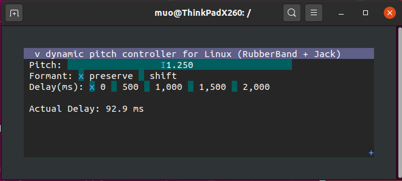
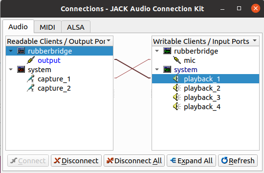

# Rubberbridge: a low-latency realtime pitch-shifter for Linux

By bridging [JACK Audio Connection Kit (Jack2)](https://jackaudio.org/) and [Rubber Band](https://github.com/breakfastquay/rubberband), Rubberbridge modifies your voice from 🎤 with few latency and it can

 * configure 75% - 200% pitch
 * choose formant preference (preserved or shifted)
 * put extra delay for monitoring purpose

ALL CHANGED IN REALTIME.


Don't like configuring audio stuff in CLI? Rubberbridge comes with easy-to-use cool (T)UI thanks to [imtui](https://github.com/ggerganov/imtui).



## Performance

Realtime pitch shifting feature Rubberbridge fully rely on RubberBand which roughly have 90 ms latency. And Jack introduces 69.7 ms independently by default, so total latency would be around 170 ms. This could be further reduced if you setup Jack to process audio frames more frequently (e.g. 512 frames/period, 2 periods/buffer, or the both) but of course it might increase CPU load.

## Build

```
$ sudo apt install libjack-jackd2-dev ncurses-dev
$ git clone --recursive https://github.com/muojp/rubberbridge.git
$ cd rubberbridge && mkdir build && cd build
$ cmake .. && make
```

## Give a try (without global install)

```
$ ./bin/rubberbridge
```

## Install

```
$ sudo make install
```

## Usage

**Plug a headphone into your PC** (otherwise terrible howling could damage your ears) and run:

```
$ rubberbridge
```

Basically you can try voice pitch-shifting without any configurations because Rubberbridge automatically configure Jack's routes in this way:

 * system microphone (capture) => input
 * output => system speaker (playback)



If you're an experienced user of Jack, you can manipulate audio route as you like, such as putting result into Web browsers or any other audio consumers.

## Author

@muojp

## LICENSE

MIT

## Credits

 * jack2: https://github.com/jackaudio/jack2
 * Rubber Band Library: https://github.com/breakfastquay/rubberband
 * imtui: https://github.com/ggerganov/imtui

Also thanks to authors and contributors of many code included in softwares listed above.
